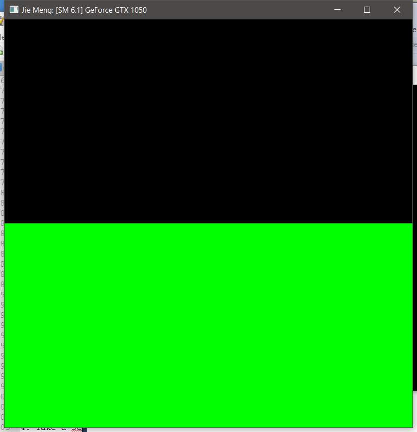
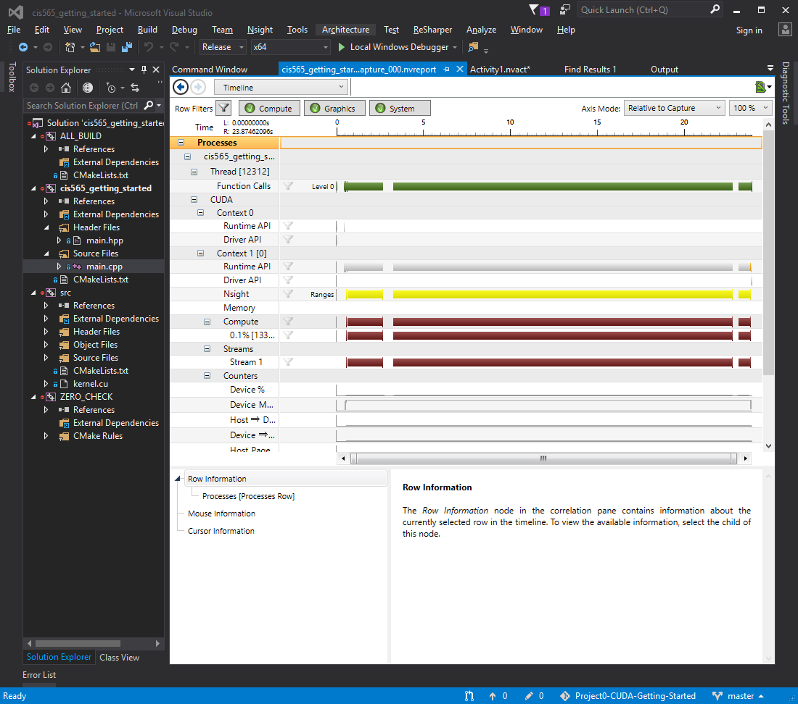
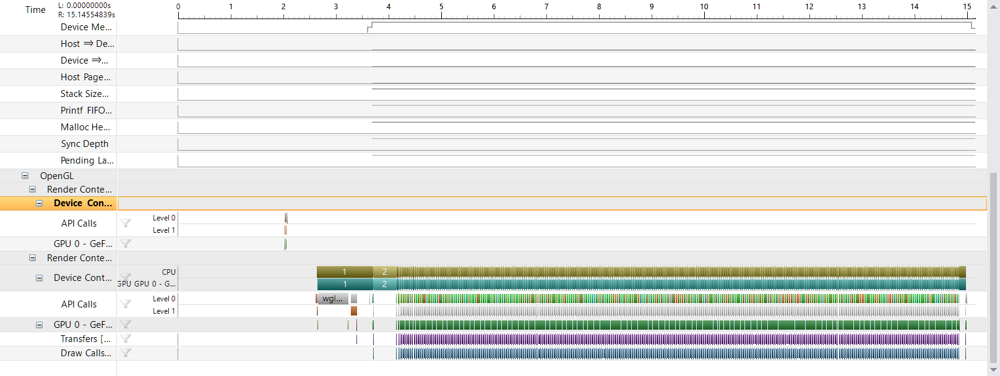
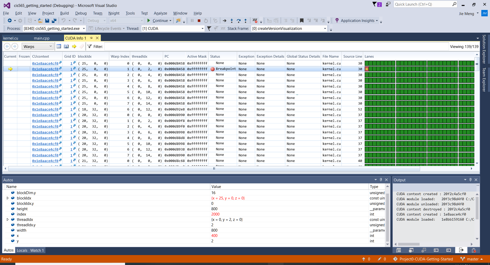

Project 0 CUDA Getting Started
====================

**University of Pennsylvania, CIS 565: GPU Programming and Architecture, Project 0**

* Jie Meng
  
  * [LinkedIn](https://www.linkedin.com/in/jie-meng/), [twitter](https://twitter.com/JieMeng6).

* Tested on: Windows 10, i7-7700HQ @ 2.80GHz, 16GB, GTX 1050 2GB (My personal laptop)

### (Screenshots)

* Sceenshot on running result

* Sceenshots on analysis timeline

* Sceenshot on CUDA Debugging, the index is set to 2000

