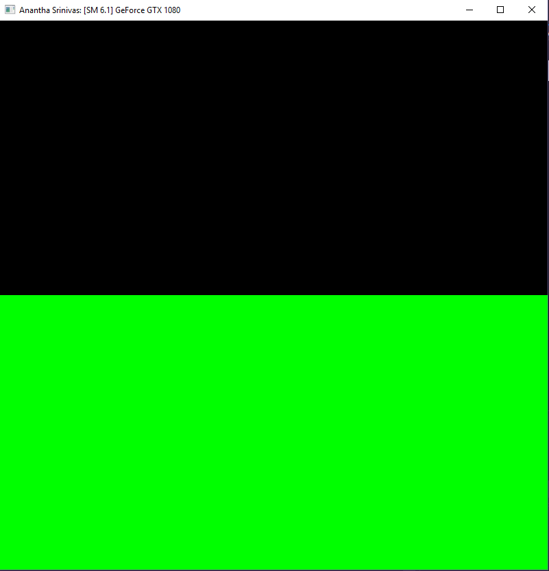
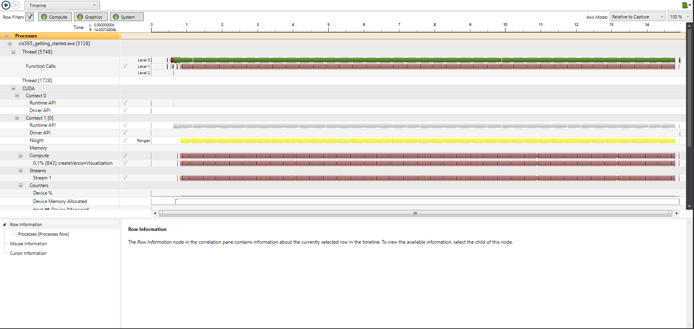
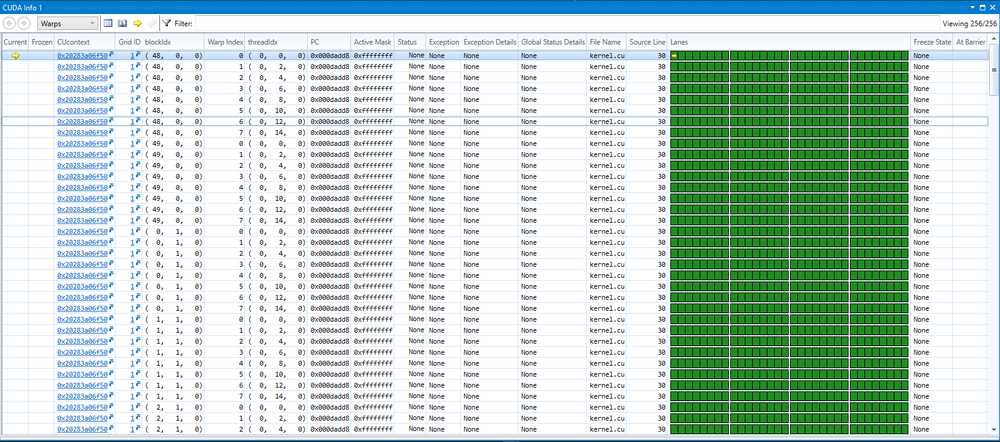
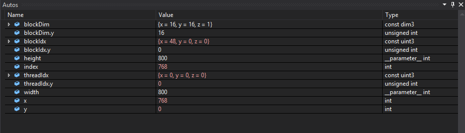

Project 0 CUDA Getting Started
====================

**University of Pennsylvania, CIS 565: GPU Programming and Architecture, Project 0**

**Anantha Srinivas**
[LinkedIn](https://www.linkedin.com/in/anantha-srinivas-00198958/), [Twitter](https://twitter.com/an2tha)

**Tested on:**
* Windows 10, i7-8700 @ 3.20GHz 16GB, GTX 1080 8097MB (Personal)
* Built for Visual Studio 2017 using the v140 toolkit

**NOTE: There is a difference in my output image and the expected one. It may be due to different SM Architecture.** 

__Output Window__

__Performance Graph__

__CUDA Info__

__Autos__

---

## Implementations

* Built CUDA project using CMAKE
* Changed Window Title to include my name
* Ran NSight Performance Analysis
* Debugged Kernel Using NSight

## Modifications to build

* Changed mimimum Compute capability to 5
* Added Visual Studio 2017 to cmake

Built using the command:

`cmake.. -G "Visual Studio 15 2017 Win64" -DCUDA_TOOLKIT_ROOT_DIR="C:\Program Files\NVIDIA GPU Computing Toolkit\CUDA\v9.2" -T v140,cuda=9.2`

