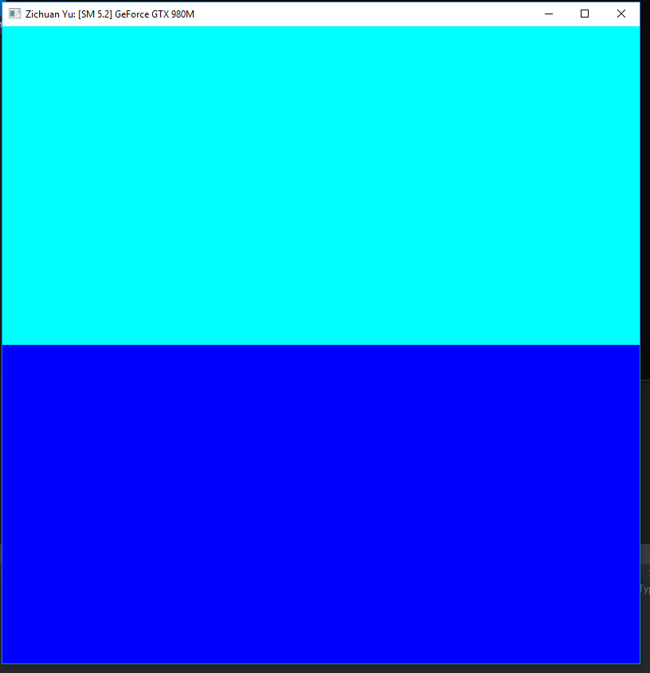
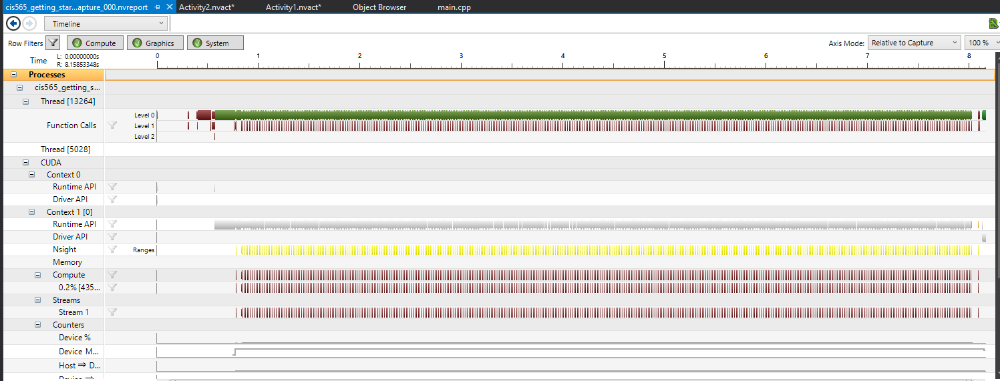
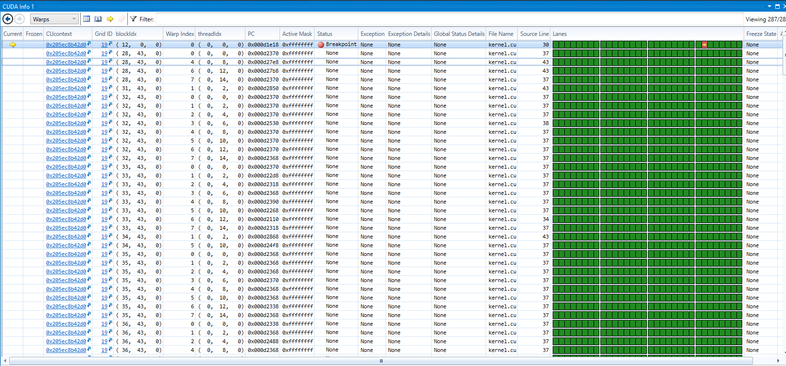

Project 0 CUDA Getting Started
====================

**University of Pennsylvania, CIS 565: GPU Programming and Architecture, Project 0**

* Zichuan Yu
  * [LinkedIn](https://www.linkedin.com/in/zichuan-yu/), [Behance](https://www.behance.net/zainyu717ebcc)
* Tested on: Windows 10.0.17134 Build 17134, i7-4710 @ 2.50GHz 16GB, GTX 980m 4096MB GDDR5

### Analysis

#### Build & Run

#### Analyze

#### Debugging

Include screenshots, analysis, etc. (Remember, this is public, so don't put
anything here that you don't want to share with the world.)

