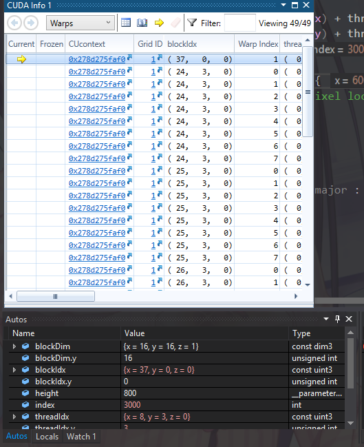

Project 0 CUDA Getting Started
====================

**University of Pennsylvania, CIS 565: GPU Programming and Architecture, Project 0**

* Henry Zhu
  * (TODO) [LinkedIn](https://www.linkedin.com/in/henry-zhu-347233121/), [personal website](https://maknee.github.io/), [twitter](https://twitter.com/maknees1), etc.
* Tested on: (TODO) Windows 10 Home, Intel i7-4710HQ @ 2.50GHz 22GB, GTX 870M (Own computer)

## Screenshots

### Title

### Timeline

### Breakpoint

## Feedback

Cool stuff

