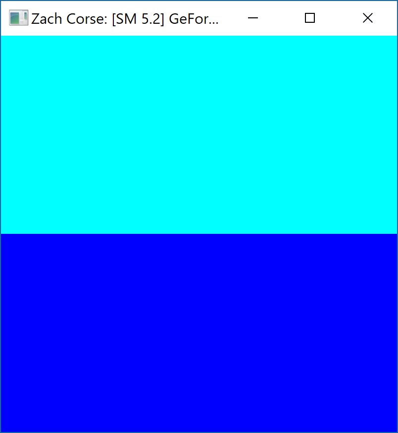
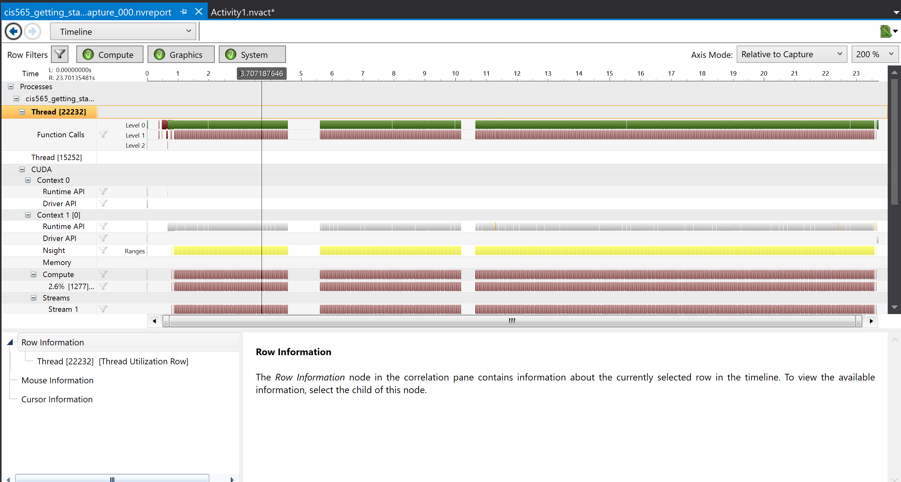

Project 0 CUDA Getting Started
====================

**University of Pennsylvania, CIS 565: GPU Programming and Architecture, Project 0**

* Zach Corse
  * LinkedIn: https://www.linkedin.com/in/wzcorse/
  * Personal Website: https://wzcorse.com
  * Twitter: @ZachCorse
* Tested on: Windows 10, i7-6700HQ @ 2.60GHz 32GB, NVIDIA GeForce GTX 970M (personal computer)

### README

This is a simple assignment to demonstrate that CUDA is up and running on my personal machine. The expected output is a texture consisting of two blocks of color, one atop the other. The image is 800x800 pixels, and each pixel is written by a single thread. We can think of this texture as a 2D matrix. On the GPU, this matrix is subdivided into 16x16 blocks of threads, giving a thread density of 50x50 per block.

*Note*: I edited line 10 of src/CMakeLists.txt. I had to specify that my specific GPU architecture is -arch=sm_50.

Running CUDA v. 9.2 in Visual Studio 15 Community.

*code output*

*demonstrating NVIDIA nsight performance analysis*

