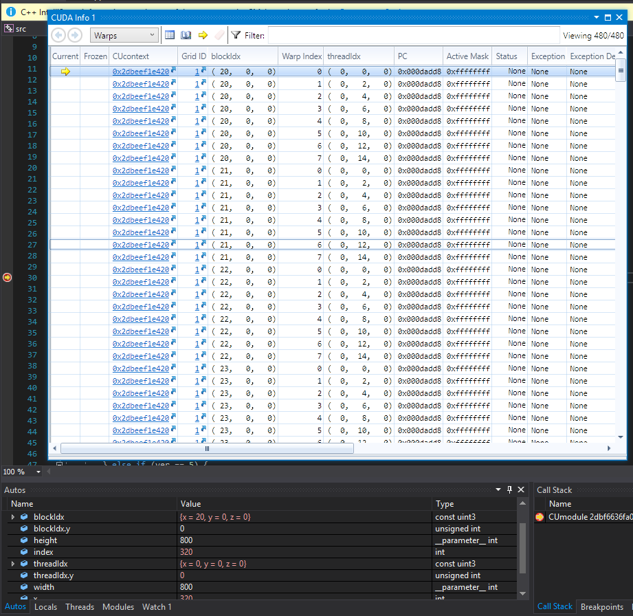

Project 0 CUDA Getting Started
====================

**University of Pennsylvania, CIS 565: GPU Programming and Architecture, Project 0**

* Alexander Chan
* Tested on: Windows 10 Version 1803, i7-5820k @ 3.70 GHz 16GB, GTX 1080 @ 1620 MHz 8GB (Personal Computer)

### README

*Note: Line 10 of `src/CMakeLists.txt` is changed to `-arch=sm_61`*

