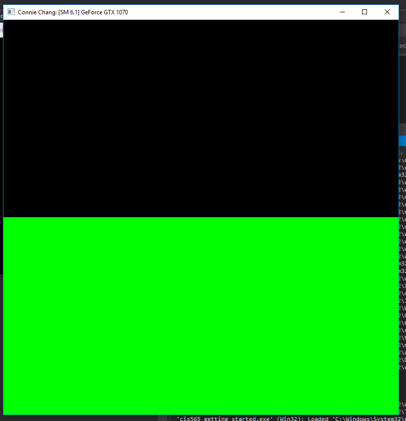
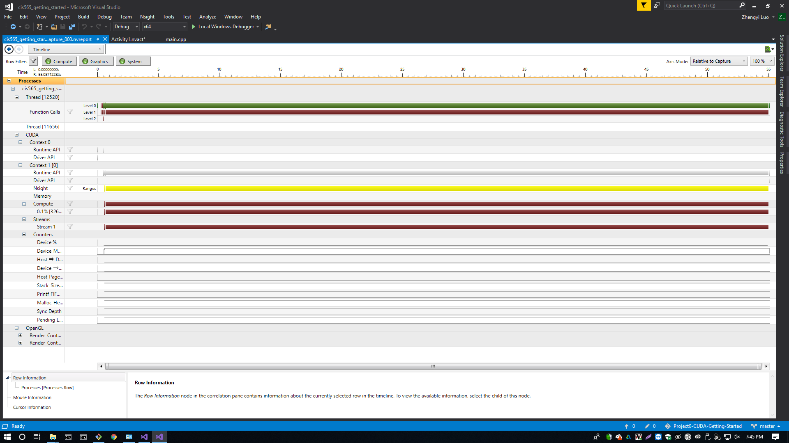
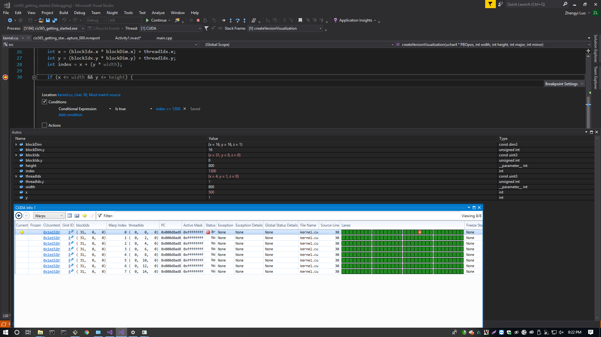

Project 0 CUDA Getting Started
====================

**University of Pennsylvania, CIS 565: GPU Programming and Architecture, Project 0**

* Connie Chang
  * [LinkedIn](https://linkedin.com/in/conniechang44), [Demo Reel](https://vimeo.com/ConChang/DemoReel)
* Tested on: Windows 10, Intel Xeon CPU E5-1630 v4 @ 3.70 GHz, GTX 1070 8GB (SIG Lab)

### Screenshots

Part 4 - Change the name of title bar

Part 5 - Performance Analysis

Part 6 - NSight

