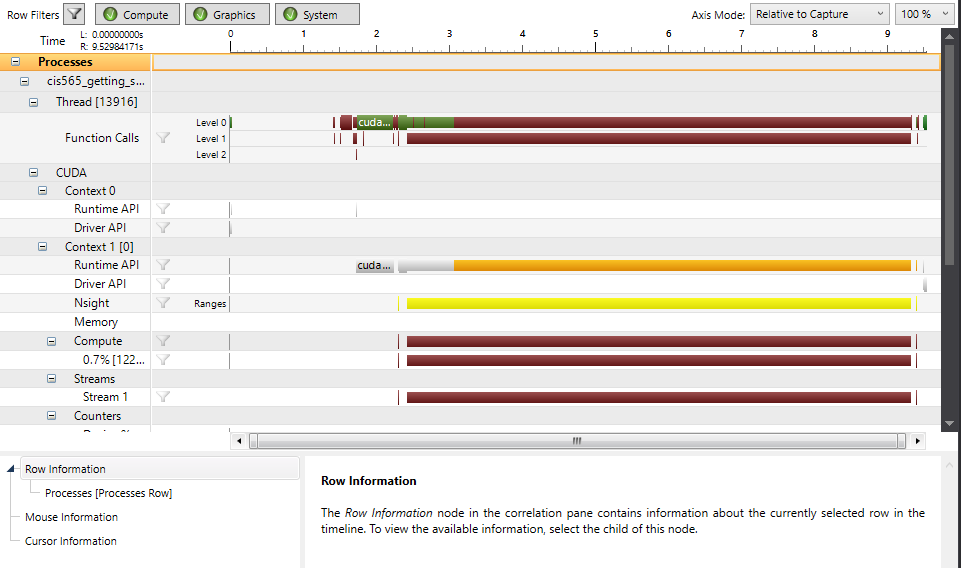

Project 0 CUDA Getting Started
====================

**University of Pennsylvania, CIS 565: GPU Programming and Architecture, Project 0**

Hannah Bollar: [LinkedIn](https://www.linkedin.com/in/hannah-bollar/), [Website](http://hannahbollar.com/)

Tested on: Windows 10 Pro, i7-6700HQ @ 2.60GHz 15.9GB, GTX 980M (Personal)
____________________________________________________________________________________
### Assignment Information

#### PART 4: Working Solution

#### PART 5: Performance Analysis (Timeline)

#### PART 6: Breakpoint Testing (Autos and CUDA Info1)

