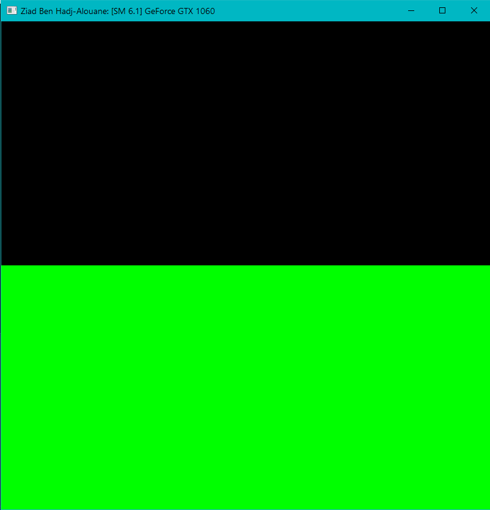

Project 0 CUDA Getting Started
====================

**University of Pennsylvania, CIS 565: GPU Programming and Architecture, Project 0**

* Ziad Ben Hadj-Alouane
  * [LinkedIn](https://www.linkedin.com/in/ziadbha/), [personal website](https://www.seas.upenn.edu/~ziadb/)
* Tested on: Windows 10, i7-8750H @ 2.20GHz, 16GB, GTX 1060

### Building & Running

Building & Running the app were done as per the instructions. I used Visual Studio 2015 to run build and ran both the Release and Debug versions. The output was the same in both cases as highlighted below.

