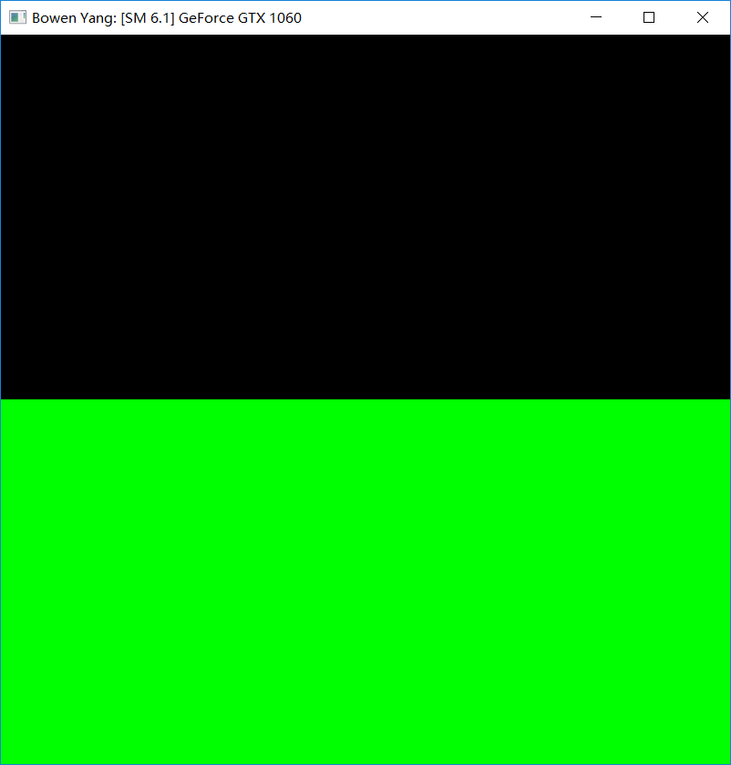
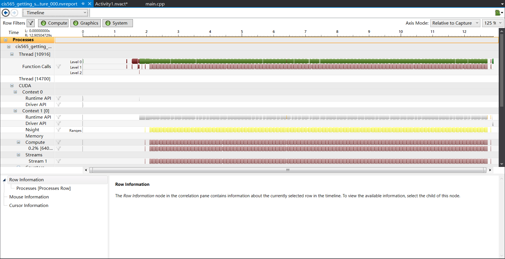
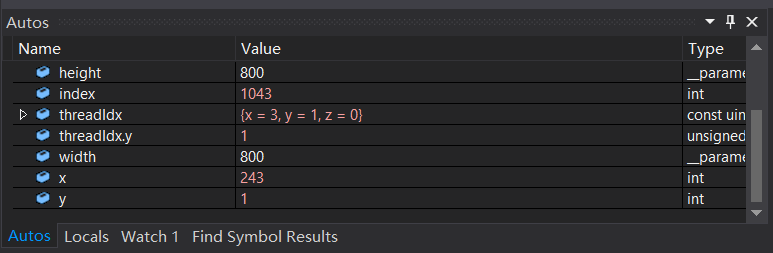
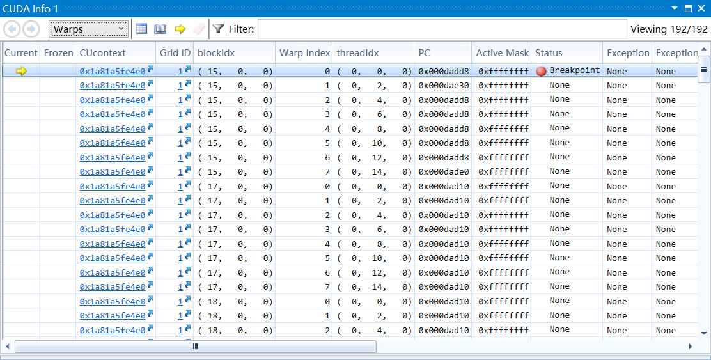

Project 0 CUDA Getting Started
====================

**University of Pennsylvania, CIS 565: GPU Programming and Architecture, Project 0**

* Name: Bowen Yang
  * [LinkedIn](https://www.linkedin.com/in/%E5%8D%9A%E6%96%87-%E6%9D%A8-83bba6148)
  * [GitHub](https://github.com/Grillnov)
  * [Facebook](https://www.facebook.com/yang.bowen.7399)
  * [Steam](https://steamcommunity.com/id/grillnov)
* Tested on: Windows 10 x64, i7-7700HQ @ 2.80GHz 16GB, GTX 1060 6GB (Personal computer)

### (TODO: Your README)

* Additional modification made to the repo
  Since I'm running CUDA 9.2 on a Pascal card and my nvcc is way too new to recognize "sm_20" as an architecture option, I had to modify the option in ./src/CMakeLists.txt and make it "sm_60" instead.

* Title bar
  
  Nice and neat in black & green, with my name on it.

* Analysis
  
  Timeline breakdown.

* Debug windows
  
  Picked index == 1043 for the breakpoint condition.
  
  
  The information of the warps.
