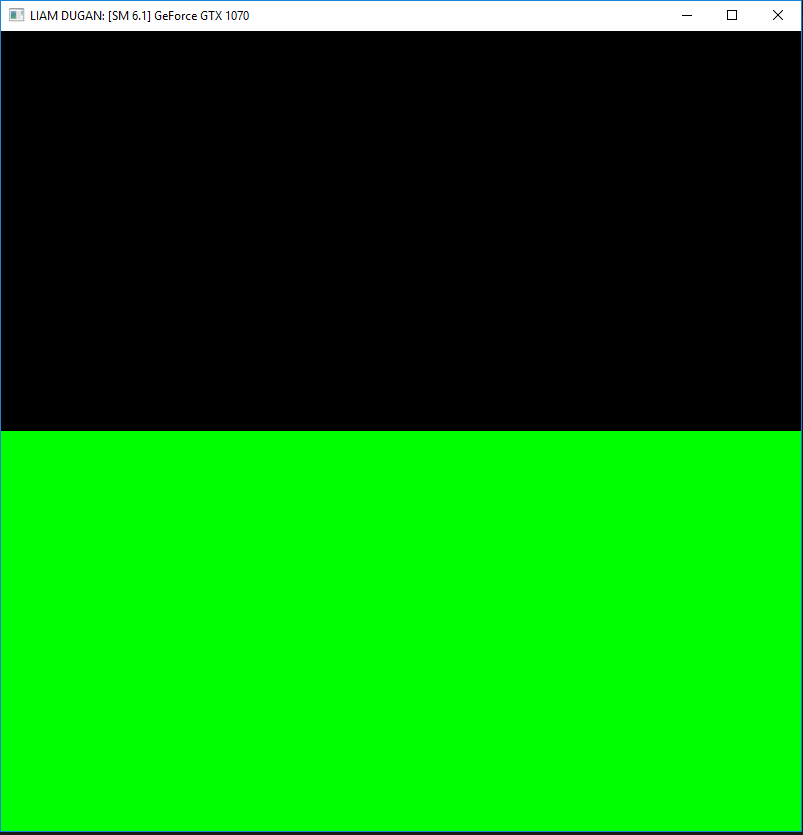
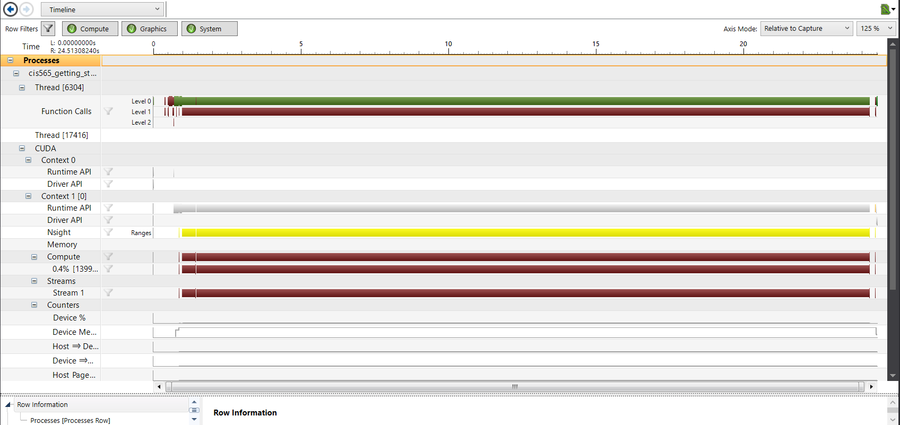
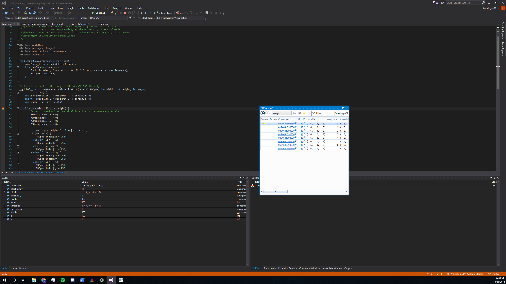

Project 0 CUDA Getting Started
====================

**University of Pennsylvania, CIS 565: GPU Programming and Architecture, Project 0**

* Liam Dugan
  * [LinkedIn](https://www.linkedin.com/in/liam-dugan-95a961135/), [personal website](http://liamdugan.com/)
* Tested on: Windows 10, Ryzen 5 1600 @ 3.20GHz 16GB, GTX 1070 16GB (Personal Computer)

### Screenshots

Output:

Timeline:

Debug Breakpoint Output:

