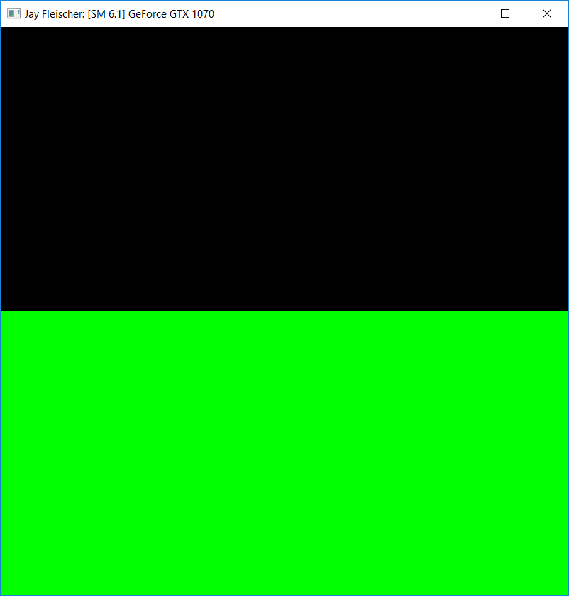
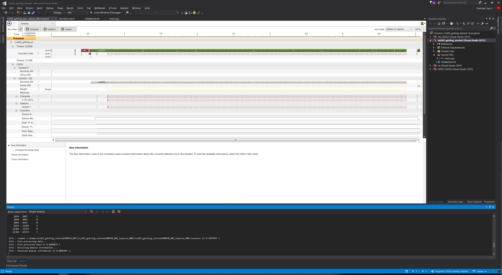
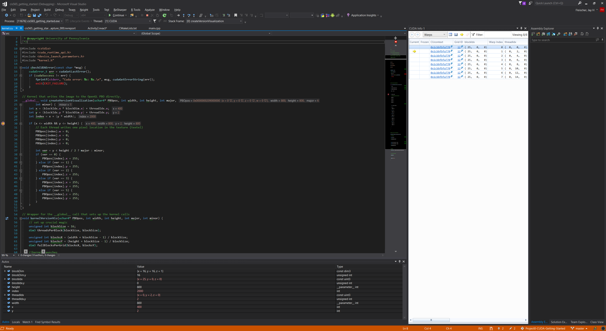

Project 0 CUDA Getting Started
====================

**University of Pennsylvania, CIS 565: GPU Programming and Architecture, Project 0**

* Jay Fleischer
  * [LinkedIn](https://www.linkedin.com/in/jayfleischer/), [Personal Website](https://jayf.engineer/)
* Tested on: Windows 10, i7-8700K @ 3.7GHz 64GB, GTX 1070 8GB (Personal Computer)

I had to modify src/CMakeLists.txt to use a more recent compute compatability (sm_30), because the sm_20 was too old and the project wouldn't build. Once I had fixed that issue and some problems with Visual Studio 2017 incompatability (thanks Vasu!), I got the sample program to build and run:

It shows up as black and green, because my GPU has a compute compatability of SM 6.1. After dealing with a port conflict, I got the performance profiler running:

Then, setting up the CUDA debugger was straightforward and I got the debugger to break at index 2000:

