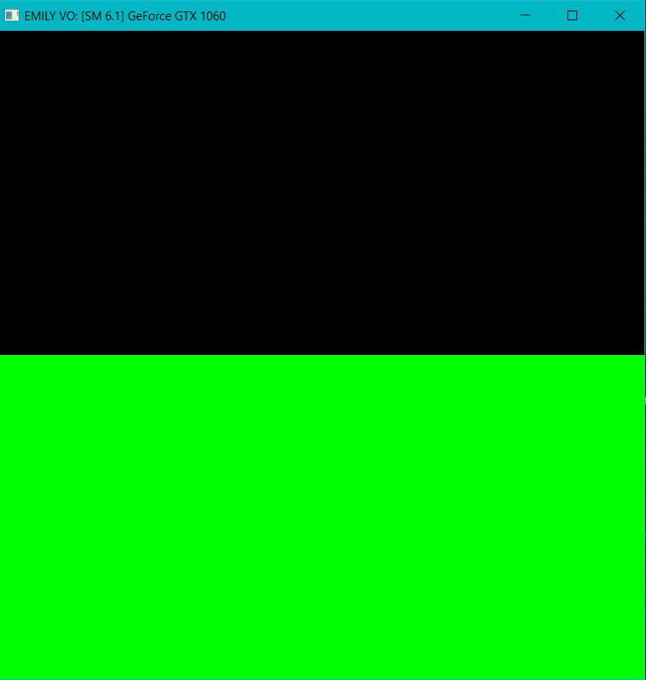
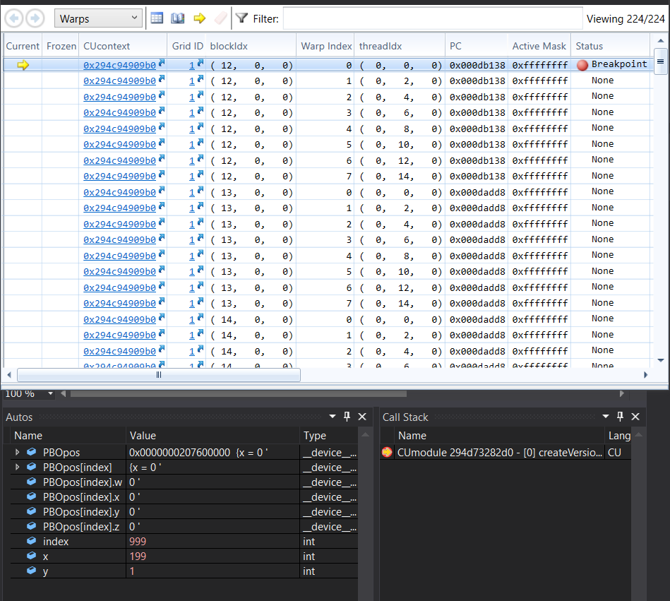

Project 0 CUDA Getting Started
====================

**University of Pennsylvania, CIS 565: GPU Programming and Architecture, Project 0**

* Emily Vo
  * [LinkedIn](linkedin.com/in/emilyvo), [personal website](emilyhvo.com)
* Tested on: Windows 10, i7-7700HQ @ 2.8GHz 16GB, GTX 1060 6GB (Personal Computer)

### README

