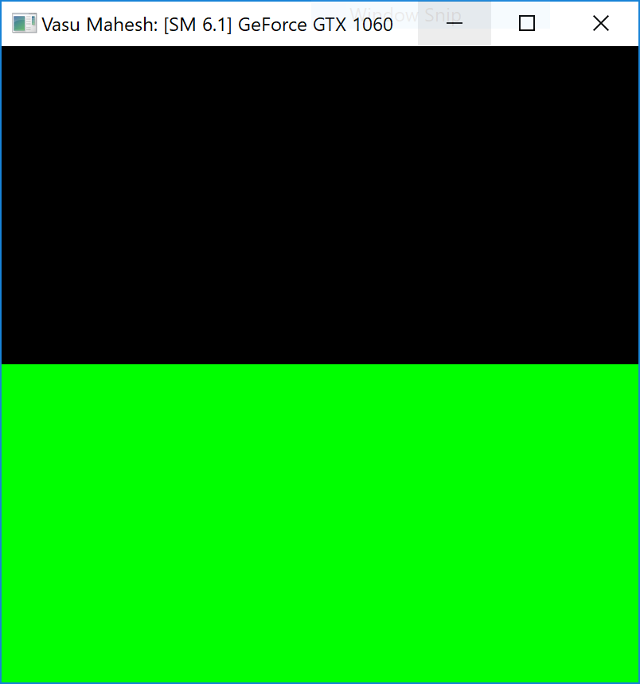
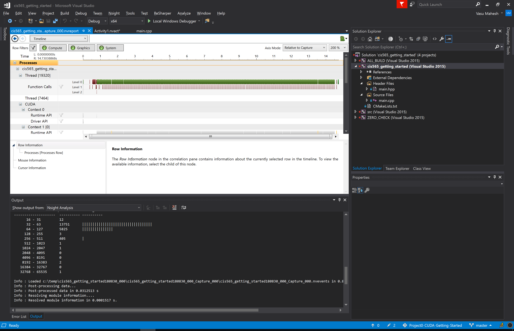
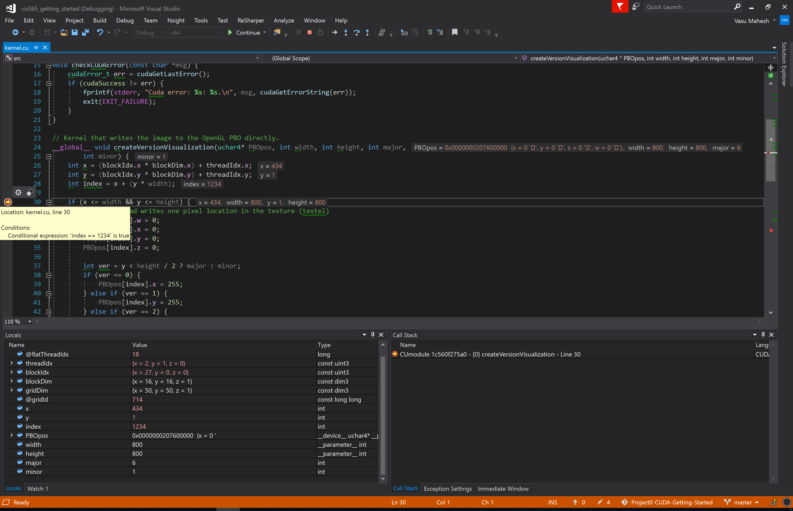
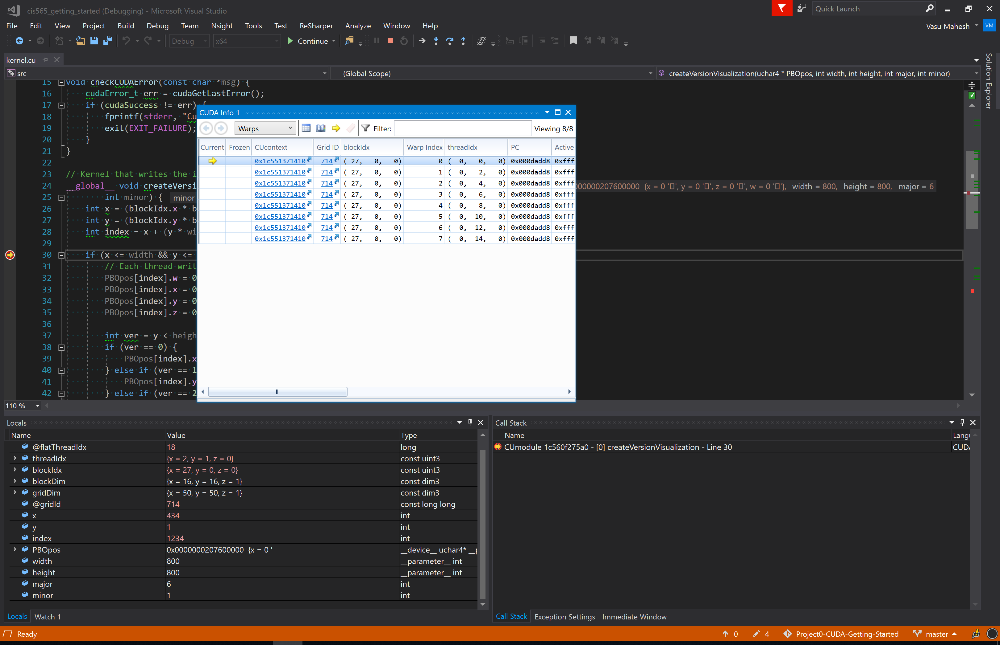

Project 0 CUDA Getting Started
====================

**University of Pennsylvania, CIS 565: GPU Programming and Architecture, Project 0**

* Vasu Mahesh
  * [LinkedIn](http://linkedin.com/in/vasumahesh), [Code Blog](www.codeplaysleep.com)

* Tested on a Laptop:
	* Windows 10
	* i7-8650U @ 1.90GHz
	* 16GB RAM
	* GTX 1060 6GB
	* Visual Studio 2017 (with v140 toolset)
	* CUDA v9.2

### Build

Build Command: `cmake -G "Visual Studio 15 2017 Win64" -DCUDA_TOOLKIT_ROOT_DIR="C:\Program Files\NVIDIA GPU Computing Toolkit\CUDA\v9.2" -T v140,cuda=9.2 ..`

### Screenshots

Application:

CUDA Timeline:

Local Variable w/ conditional breakpoint:

With Warp Window:

