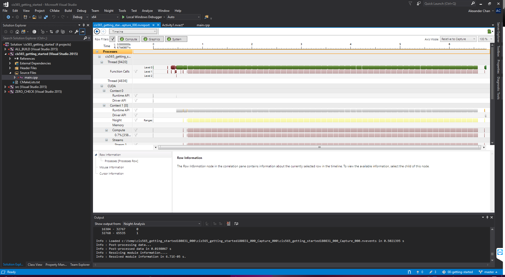
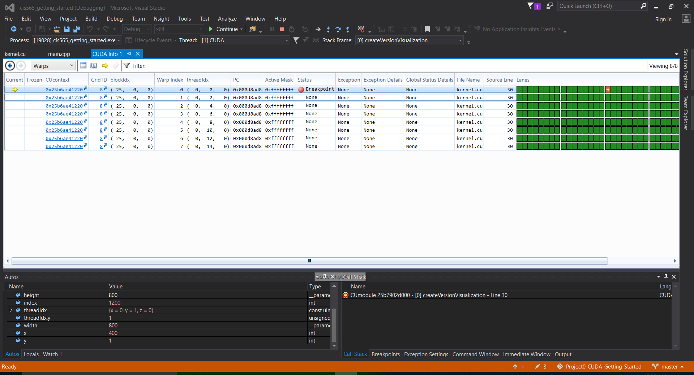

Project 0 CUDA Getting Started
====================

**University of Pennsylvania, CIS 565: GPU Programming and Architecture, Project 0**

* Siyu Zheng
* Tested on: Windows 10, i7-8750 @ 2.20GHz 16GB, GTX 1060 (Personal Laptop)

### Siyu Zheng Readme

Include screenshots, analysis, etc. (Remember, this is public, so don't put
anything here that you don't want to share with the world.)
* Application screenshot

* Timeline screeshot

* Warp screenshot

I have modified "CMakeLists.txt" in /src. Change "-arch=sm_20" to "-arch=sm_30".

