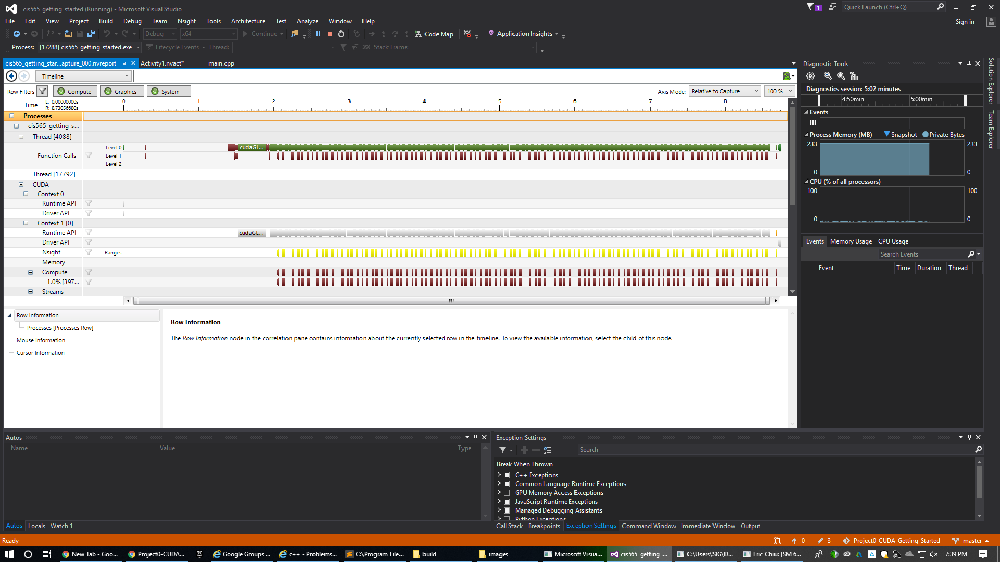

Project 0 CUDA Getting Started
====================

**University of Pennsylvania, CIS 565: GPU Programming and Architecture, Project 0**

* Eric Chiu
  * [LinkedIn](http://linkedin.com/in/echiu1997), [personal website](http://www.erichiu.com/)
* Tested on: Windows 10 Education, Intel(R) Xeon(R) CPU E5-1630 v4 @ 3.60GHz 32GB, NVIDIA GeForce GTX 1070 (SIGLAB)

### (README)

Include screenshots, analysis, etc. (Remember, this is public, so don't put
anything here that you don't want to share with the world.)

