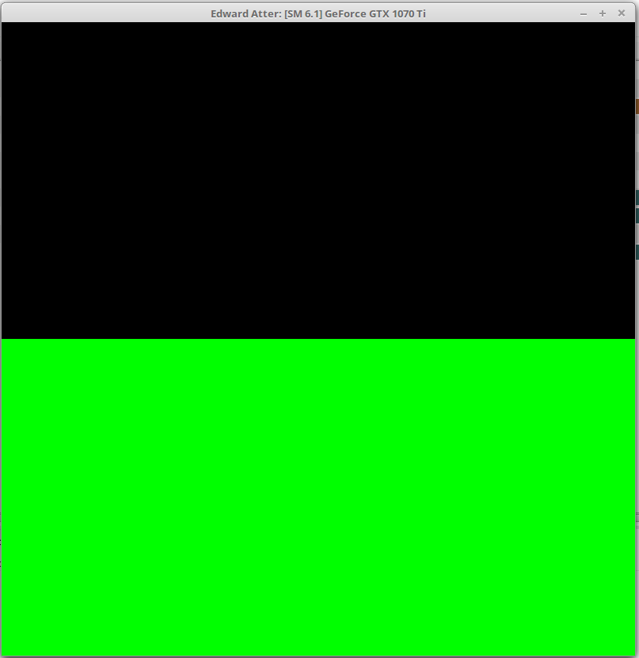

Project 0 CUDA Getting Started
====================

**University of Pennsylvania, CIS 565: GPU Programming and Architecture, Project 0**

* Yu Sun
* [LinkedIn](https://www.linkedin.com/in/yusun3/)
* Tested on: Linux, i7-6700HQ CPU @ 2.60GHz × 8 , GeForce GTX 960M/PCIe/SSE2, 7.7GB Memory (Personal Computer)

### 

