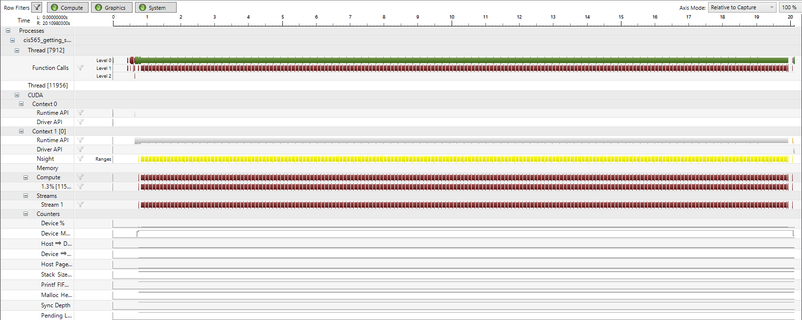

Project 0 Getting Started
====================

**University of Pennsylvania, CIS 565: GPU Programming and Architecture, Project 0**

* Wanru Zhao
  * [LinkedIn](www.linkedin.com/in/wanru-zhao).
* Tested on: Windows 10 Education, Intel(R) Xeon(R) CPU E5-1630 v4 @ 3.70GHz 32.0 GB, GTX 1070(SIG Lab)

### Screenshots

* Window with changed string(to my name)

* Performance analysis with tab Timeline

* Nsight Debugging
  * Autos
  
  
  
  * CUDA info Warp
  
  
