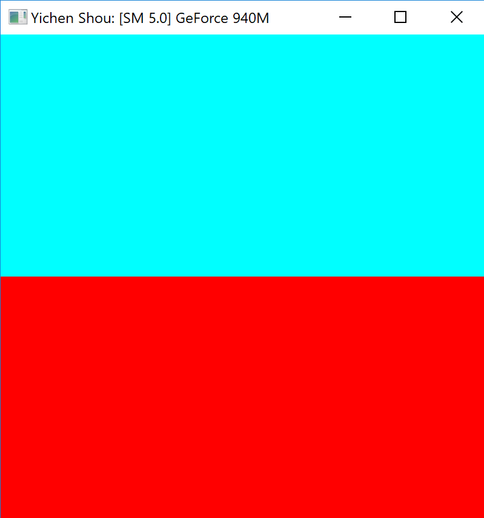
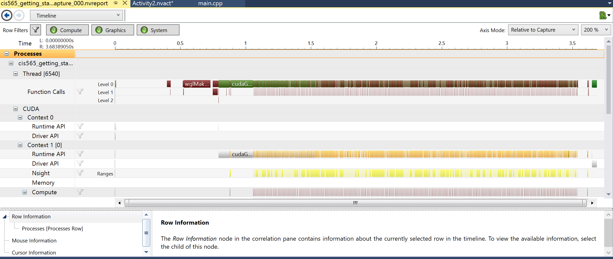
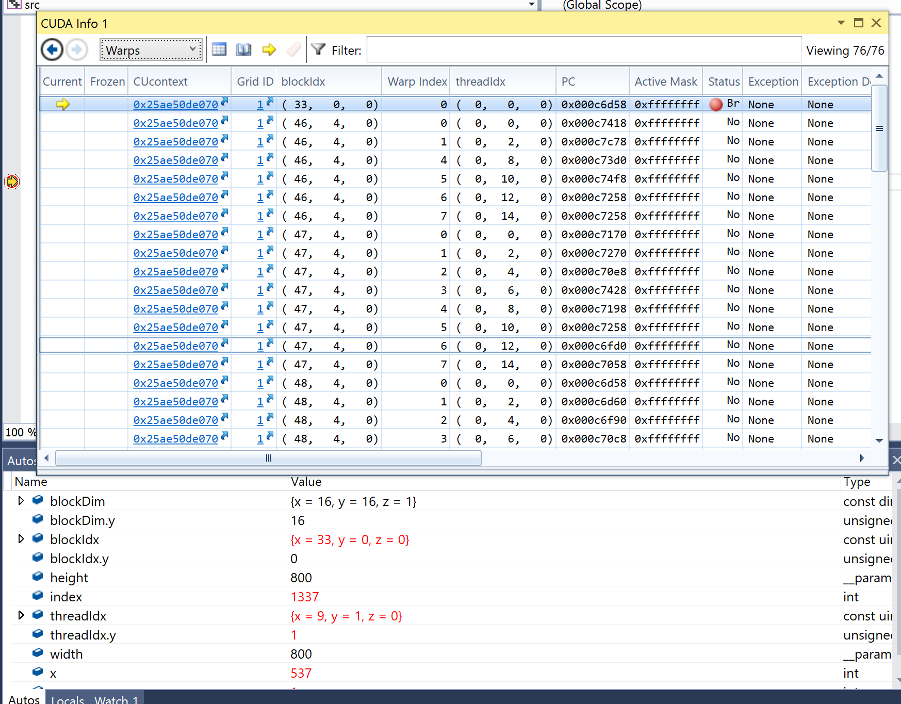

Project 0 CUDA Getting Started
====================

**University of Pennsylvania, CIS 565: GPU Programming and Architecture, Project 0**

* Yichen Shou
  * [LinkedIn](https://www.linkedin.com/in/yichen-shou-68023455/), [personal website](http://www.yichenshou.com/)
* Tested on: Windows 10, i7-6500U @ 2.50GHz 12GB RAM, GeForce 940M 8GB (Personal Laptop)

## Screenshots
### Initial ScreenShot

### NSight Timeline

### CUDA Debugger

## Comments

* Compiled and Built using VS2015 and CUDA 8.0
* Changed "src/CMAKELIST.txt" 
  * from "OPTIONS -arch=sm_20" to "OPTIONS -arch=sm_50"
  * "sm_50" corresponds to my GPU's 5.0 compute capability
  * Thanks to Bowen Yang on the course Google group for suggesting this change.