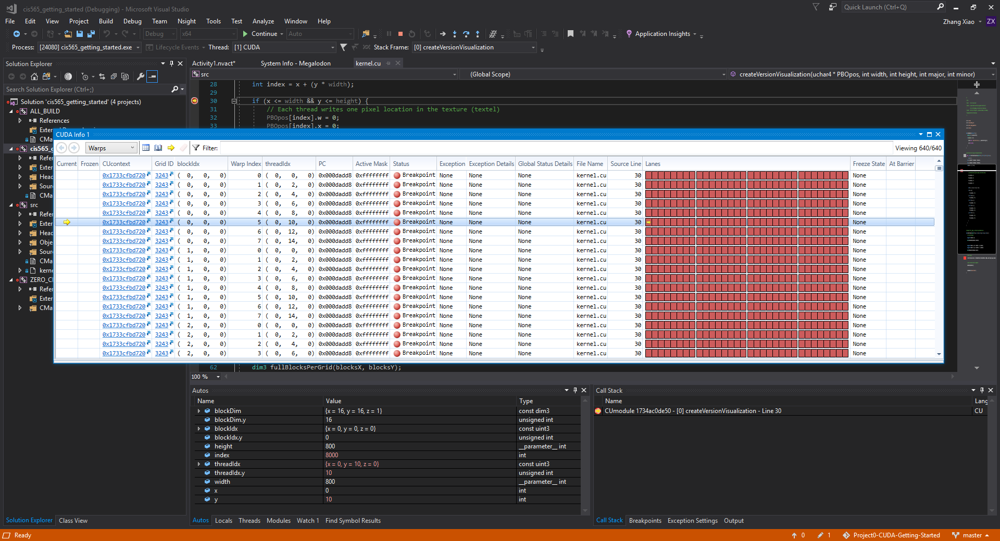

Project 0 CUDA Getting Started
====================

**University of Pennsylvania, CIS 565: GPU Programming and Architecture, Project 0**

* Xinyu Lin
[Linkedin](https://www.linkedin.com/in/xinyu-lin-138352125/)
* Tested on: Windows 10 Education, Intel(R) Xeon(R) CPU E5-1630 v4 @ 3.70GHz 32.0GB, GTX1070(SIG Lab)

### Xinyu Lin
* Change the string

Include screenshots, analysis, etc. (Remember, this is public, so don't put
anything here that you don't want to share with the world.)

* Timeline of Performance Analysis

* Nisght Debugging 

1. Autos

 

2. CUDA info warp
 
